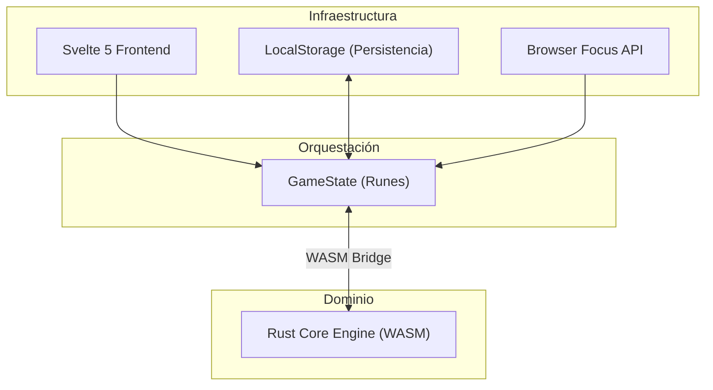

# Sudoku Scientific 🧩

Una aplicación de Sudoku de alto rendimiento construida con una **Arquitectura Hexagonal**, centrada en el rendimiento cognitivo y la soberanía del usuario (Local-first).

---

## 🚀 Características Principales

- **WASM Core**: Motor de resolución y generación escrito en Rust para máxima velocidad.
- **Svelte 5 Runes**: Interfaz ultra-reactiva y ligera.
- **Local-first**: Persistencia total en el navegador sin necesidad de servidores externos.
- **Cognitive Flow**: Diseño optimizado para mantener la concentración profunda (Deep Work).

## 🏗️ Arquitectura Técnica

El proyecto sigue un patrón de **Puertos y Adaptadores (Hexagonal)** para desacoplar la lógica de negocio de la infraestructura.

### 📦 Estructura del Proyecto

```text
.
├── core-engine/        # Dominio (Rust): Generador y Solver WASM
├── web-interface/     # Adaptador UI (Svelte 5): Interfaz y Estado
├── shared/            # Contratos de tipos TypeScript compartidos
├── README.md          # Documentación técnica
└── package.json       # Orquestador de builds
```

### 🧱 Capas
1. **El Núcleo (Domain)**: En `core-engine/`. Generación de tableros y validación de reglas.
2. **Capa Secundaria (Shared)**: En `shared/`. Definiciones de tipos para comunicación WASM.
3. **Adaptador de Entrada (Driving)**: En `web-interface/`. Svelte 5 gestionando la interacción.
4. **Adaptadores de Salida (Driven)**: Persistencia en `localStorage` y APIs de foco del navegador.

---

## 🗺️ Diagrama de Flujo



---

## 🛠️ Instalación y Desarrollo

### Requisitos
- [Node.js](https://nodejs.org/) (v18+)
- [Rust](https://www.rust-lang.org/) (v1.70+)
- [wasm-pack](https://rustwasm.github.io/wasm-pack/installer/)

### Pasos de Instalación

1.  **Clonar y configurar raíz**:
    ```bash
    npm install
    ```

2.  **Compilar el Núcleo (WASM)**:
    ```bash
    npm run build:core
    ```

3.  **Iniciar Desarrollo Web**:
    ```bash
    cd web-interface
    npm install
    npm run dev
    ```

---

## ⚡ Pilares de Diseño

- **🎨 LCH Color Space**: Colores calculados para minimizar la fatiga visual.
- **🧩 Leyes Gestalt**: Jerarquía visual reforzada para facilitar el escaneo rítmico.
- **🏆 Dopamine Loop**: Celebración instantánea y métricas de rendimiento real.

---

## 📝 Licencia

Este proyecto está bajo la Licencia MIT. Consulta el archivo [LICENSE.md](LICENSE.md) para más detalles.
